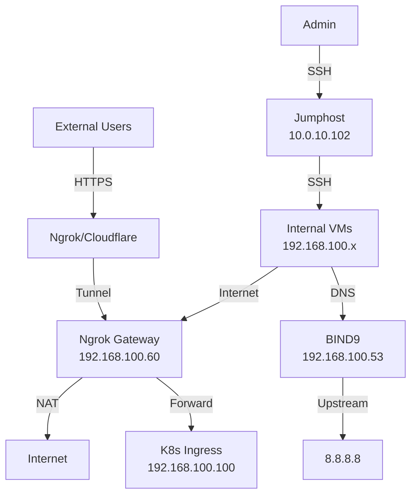

# Развертывание Production-ready E-Commerce инфраструктуры в Proxmox

> **DevOps проект**: Комплексная инфраструктура с K3s, CI/CD, мониторингом и логированием

## Содержание

1. [Введение и архитектура](#введение)
2. [Сетевая инфраструктура](#сетевая-инфраструктура)
3. [DNS сервер (BIND9)](#dns-сервер-bind9)
4. [Интернет-шлюз (NAT Gateway)](#интернет-шлюз)
5. [Object Storage (MinIO)](#object-storage-minio)
6. [Kubernetes кластер (K3s)](#kubernetes-кластер-k3s)
7. [Persistent Storage (Longhorn)](#persistent-storage-longhorn)
8. [Ingress Controller (Traefik+Metalib)](#ingress-controller-traefik)
9. [Внешний доступ (ngrok Tunnel)](#внешний-доступ)
10. [CI/CD (Jenkins)](#cicd-jenkins)
11. [Мониторинг (Prometheus Stack)](#мониторинг-prometheus-stack)
12. [Логирование (ELK Stack)](#логирование-elk-stack)
13. [GitOps (ArgoCD)](#gitops-argocd)
14. [Развертывание приложения EasyShop](#развертывание-приложения)
15. [Заключение](#заключение)

---

## Введение

### Цель проекта

Создание полнофункциональной production-ready DevOps инфраструктуры для развертывания e-commerce приложения с автоматизацией CI/CD, мониторингом, логированием и обеспечением высокой доступности.

### Используемые технологии

- **Виртуализация**: Proxmox VE 9.x
- **Оркестрация**: Kubernetes (K3s)
- **CI/CD**: Jenkins, ArgoCD
- **Мониторинг**: Prometheus, Grafana, AlertManager
- **Логирование**: Elasticsearch, Logstash, Kibana
- **Storage**: Longhorn (persistent), MinIO (object storage)
- **Сеть**: BIND9 (DNS), Traefik (Ingress), Cloudflare Tunnel
- **IaC**: Terraform (создание VM)

### Архитектура инфраструктуры

```
Internet (Серый IP)
    ↓
Ngrok Tunnel (Ngrok-tunnel VM)
    ↓ [NAT Gateway]
    ↓
Traefik Ingress Controller (K3s)
    ↓
┌────────────────────────────────────────────┐
│   K3s Cluster (192.168.100.0/24)           │
│  ┌──────────┬──────────┬──────────┐        │
│  │ Master   │ Worker-1 │ Worker-2 │        │
│  │ 4C/8GB   │ 4C/10GB  │ 4C/10GB  │        │
│  └──────────┴──────────┴──────────┘        │
│                                             │
│  Applications:                              │
│  - EasyShop (E-commerce)                    │
│  - ArgoCD (GitOps deployment)              │
│  - Prometheus/Grafana (Metrics)            │
│  - Elasticsearch/Kibana (Logs)             │
│  - AlertManager → Slack                    │
└────────────────────────────────────────────┘
    ↓                    ↓
Jenkins CI          MinIO S3
(192.168.100.101)   (192.168.100.20)

Infrastructure Services:
- BIND9 DNS (192.168.100.53)
- NAT Gateway (192.168.100.50)
- Jumphost (192.168.100.5)
```


### Потоки трафика



### Спецификация виртуальных машин

| Hostname | vCPU | RAM | Disk | IP | Роль |
|----------|------|-----|------|-----|------|
| dns-server | 1 | 1GB | 10GB | 10.0.10.53<br>192.168.100.53 | DNS Server (BIND9) |
| ngrok-tunnel | 1 | 1GB | 10GB | 10.0.10.60<br>192.168.100.60 | NAT Gateway + Tunnel |
| k3s-master | 4 | 8GB | 60GB | 192.168.100.10 | K3s Control Plane |
| k3s-worker-1 | 4 | 10GB | 80GB | 192.168.100.11 | K3s Worker Node |
| k3s-worker-2 | 4 | 10GB | 80GB | 192.168.100.12 | K3s Worker Node |
| jenkins | 2 | 4GB | 40GB | 192.168.100.101 | CI Server |
| minio | 2 | 4GB | 20GB+100GB | 192.168.100.20 | Object Storage |
| jumphost | 1 | 2GB | 20GB | 10.0.10.102<br>192.168.100.5 | Management Host |

**Итого**: 19 vCPU, 40GB RAM, 420GB Disk

### Карта сервисов

| Сервис | Внутренний домен | Внешний домен | Порт |
|--------|------------------|---------------|------|
| EasyShop | easyshop.local.lab | easyshop.yourdomain.com | 80/443 |
| ArgoCD | argocd.local.lab | argocd.yourdomain.com | 80/443 |
| Grafana | grafana.local.lab | grafana.yourdomain.com | 80/443 |
| Prometheus | prometheus.local.lab | prometheus.yourdomain.com | 80/443 |
| AlertManager | alertmanager.local.lab | alertmanager.yourdomain.com | 80/443 |
| Kibana | kibana.local.lab | kibana.yourdomain.com | 80/443 |
| Jenkins | jenkins.local.lab | jenkins.yourdomain.com | 8080 |
| MinIO Console | minio.local.lab | - | 9001 |
| Longhorn UI | longhorn.local.lab | - | 80 |

---

## Сетевая инфраструктура

### Конфигурация сети Proxmox

Все VM уже созданы через Terraform. Проверим конфигурацию сети на Proxmox хосте:

```bash
# SSH в Proxmox хост
ssh root@10.0.10.200

# Проверка существующих bridges
ip addr show vmbr0  # Внешняя сеть 10.0.10.0/24
ip addr show vmbr1  # Внутренняя сеть 192.168.100.0/24

# Если vmbr1 не настроен, создайте его
nano /etc/network/interfaces
```

Добавьте конфигурацию vmbr1 (если отсутствует):

```
auto vmbr1
iface vmbr1 inet static
    address 192.168.100.1/24
    bridge-ports none
    bridge-stp off
    bridge-fd 0
    comment "Internal Network"
```

Применить изменения:

```bash
ifreload -a
ip addr show vmbr1  # Проверка
```

### Схема сетей

```
10.0.10.0/24 (vmbr0) - Внешняя сеть
├── 10.0.10.1        - Gateway (роутер ISP)
├── 10.0.10.60       - ngrok-tunnel (eth0)
├── 10.0.10.53       - dns-server (eth0)
├── 10.0.10.102      - jumphost (eth0)
└── 10.0.10.200      - Proxmox host

192.168.100.0/24 (vmbr1) - Внутренняя сеть
├── 192.168.100.1    - Proxmox vmbr1
├── 192.168.100.5    - jumphost (eth1)
├── 192.168.100.10   - k3s-master
├── 192.168.100.11   - k3s-worker-1
├── 192.168.100.12   - k3s-worker-2
├── 192.168.100.20   - minio
├── 192.168.100.60   - ngrok-tunnel (eth1) [NAT Gateway]
├── 192.168.100.53   - dns-server (eth1)
└── 192.168.100.101  - jenkins
```

---

## DNS сервер (BIND9)

### Установка BIND9

SSH в dns-server:

```bash
ssh admin@10.0.10.53
```

Установка пакетов:

```bash
# Обновление системы
sudo apt update && sudo apt upgrade -y

# Установка BIND9
sudo apt install -y bind9 bind9utils bind9-doc dnsutils

# Останов systemd-resolved (конфликтует с BIND)
sudo systemctl disable systemd-resolved
sudo systemctl stop systemd-resolved
sudo rm -f /etc/resolv.conf
```

### Основная конфигурация

Создание файла `/etc/bind/named.conf.options`:

```bash
sudo bash -c 'cat > /etc/bind/named.conf.options <<EOF
options {
    directory "/var/cache/bind";

    // Слушать на всех интерфейсах
    listen-on { 127.0.0.1; 192.168.100.53; 10.0.10.53; };
    listen-on-v6 { none; };

    // Разрешить запросы из локальных сетей
    allow-query { 
        localhost; 
        192.168.100.0/24; 
        10.0.10.0/24; 
    };

    // Рекурсия для локальных сетей
    recursion yes;
    allow-recursion { 
        localhost; 
        192.168.100.0/24; 
        10.0.10.0/24; 
    };

    // Форвардинг на публичные DNS
    forwarders {
        8.8.8.8;
        8.8.4.4;
    };

    dnssec-validation auto;
    auth-nxdomain no;
};
EOF'
```

### Конфигурация зон

Создание файла `/etc/bind/named.conf.local`:

```bash
sudo bash -c 'cat > /etc/bind/named.conf.local <<EOF
// Прямая зона для local.lab
zone "local.lab" {
    type master;
    file "/etc/bind/zones/db.local.lab";
    allow-update { none; };
};

// Обратная зона для 192.168.100.0/24
zone "100.168.192.in-addr.arpa" {
    type master;
    file "/etc/bind/zones/db.192.168.100";
    allow-update { none; };
};

// Обратная зона для 10.0.10.0/24
zone "10.0.10.in-addr.arpa" {
    type master;
    file "/etc/bind/zones/db.10.0.10";
    allow-update { none; };
};
EOF'
```

### Создание файлов зон

Создание директории:

```bash
sudo mkdir -p /etc/bind/zones
```

#### Прямая зона (db.local.lab)

```bash
sudo bash -c 'cat > /etc/bind/zones/db.local.lab <<EOF
\$TTL    604800
@       IN      SOA     ns1.local.lab. admin.local.lab. (
                              1         ; Serial
                         604800         ; Refresh
                          86400         ; Retry
                        2419200         ; Expire
                         604800 )       ; Negative Cache TTL

; Name servers
@       IN      NS      ns1.local.lab.

; A records для NS
ns1     IN      A       192.168.100.53

; Инфраструктурные VM
dns-server      IN      A       192.168.100.53
cf-tunnel       IN      A       192.168.100.50
ngrok-tunnel    IN      A       192.168.100.60
jumphost        IN      A       192.168.100.5

; Kubernetes кластер
k3s-master      IN      A       192.168.100.10
k3s-worker-1    IN      A       192.168.100.11
k3s-worker-2    IN      A       192.168.100.12

; Дополнительные сервисы
jenkins         IN      A       192.168.100.101
minio           IN      A       192.168.100.20

; Сервисные записи (Ingress)
easyshop         IN      A       192.168.100.10
argocd          IN      A       192.168.100.10
grafana         IN      A       192.168.100.10
prometheus      IN      A       192.168.100.10
alertmanager    IN      A       192.168.100.10
kibana          IN      A       192.168.100.10
longhorn        IN      A       192.168.100.10

; CNAME для удобства
www.easyshop     IN      CNAME   easyshop.local.lab.
ci              IN      CNAME   jenkins.local.lab.
s3              IN      CNAME   minio.local.lab.
EOF'
```

#### Обратная зона для 192.168.100.0/24

```bash
sudo bash -c 'cat > /etc/bind/zones/db.192.168.100 <<EOF
\$TTL    604800
@       IN      SOA     ns1.local.lab. admin.local.lab. (
                              1         ; Serial
                         604800         ; Refresh
                          86400         ; Retry
                        2419200         ; Expire
                         604800 )       ; Negative Cache TTL

@       IN      NS      ns1.local.lab.

; PTR записи
5       IN      PTR     jumphost.local.lab.
10      IN      PTR     k3s-master.local.lab.
11      IN      PTR     k3s-worker-1.local.lab.
12      IN      PTR     k3s-worker-2.local.lab.
20      IN      PTR     minio.local.lab.
50      IN      PTR     cf-tunnel.local.lab.
60      IN      PTR     ngrok-tunnel.local.lab.
53      IN      PTR     dns-server.local.lab.
53      IN      PTR     ns1.local.lab.
101     IN      PTR     jenkins.local.lab.
EOF'
```

#### Обратная зона для 10.0.10.0/24

```bash
sudo bash -c 'cat > /etc/bind/zones/db.10.0.10 <<EOF
\$TTL    604800
@       IN      SOA     ns1.local.lab. admin.local.lab. (
                              1         ; Serial
                         604800         ; Refresh
                          86400         ; Retry
                        2419200         ; Expire
                         604800 )       ; Negative Cache TTL

@       IN      NS      ns1.local.lab.

; PTR записи
50      IN      PTR     cf-tunnel.local.lab.
60      IN      PTR     ngrok-tunnel.local.lab.
53      IN      PTR     dns-server.local.lab.
102     IN      PTR     jumphost.local.lab.
EOF'
```

### Проверка и запуск BIND9

```bash
# Проверка синтаксиса конфигурации
sudo named-checkconf

# Проверка файлов зон
sudo named-checkzone local.lab /etc/bind/zones/db.local.lab
sudo named-checkzone 100.168.192.in-addr.arpa /etc/bind/zones/db.192.168.100
sudo named-checkzone 10.0.10.in-addr.arpa /etc/bind/zones/db.10.0.10

# Установка прав
sudo chown -R bind:bind /etc/bind/zones

# Перезапуск BIND9
sudo systemctl restart bind9
sudo systemctl enable named

# Проверка статуса
sudo systemctl status bind9
```

### Тестирование DNS

```bash
# Прямые запросы
dig @192.168.100.53 k3s-master.local.lab +short
# Ожидаем: 192.168.100.10

dig @192.168.100.53 easyshop.local.lab +short
# Ожидаем: 192.168.100.10

nslookup jenkins.local.lab 192.168.100.53

# Обратные запросы
dig @192.168.100.53 -x 192.168.100.10 +short
# Ожидаем: k3s-master.local.lab.

# Проверка рекурсии (форвардинг)
dig @192.168.100.53 google.com +short

# Просмотр всех записей зоны
dig @192.168.100.53 local.lab AXFR
```

### Временная настройка DNS на dns-server

```bash
# На dns-server настроим сам себя
sudo bash -c 'cat > /etc/resolv.conf <<EOF
nameserver 127.0.0.1
nameserver 8.8.8.8
search local.lab
EOF'

sudo chattr +i /etc/resolv.conf

# Проверка
ping -c 2 google.com
```

---

## Интернет-шлюз

### Настройка NAT на ngrok-tunnel

VM `на ngrok-tunnel` будет служить NAT-шлюзом для всех машин во внутренней сети 192.168.100.0/24.

SSH в ngrok-tunnel:

```bash
ssh admin@10.0.10.60
```

#### Включение IP forwarding

```bash
# Временно
sudo sysctl -w net.ipv4.ip_forward=1

# Постоянно
sudo bash -c 'echo "net.ipv4.ip_forward=1" >> /etc/sysctl.conf'
sudo sysctl -p
```

#### Настройка NAT (iptables)

```bash
# Установка iptables-persistent
sudo apt update
sudo apt install -y iptables-persistent

# Настройка NAT
# eth0 - интерфейс в сеть 10.0.10.0/24 (внешняя)
# eth1 - интерфейс в сеть 192.168.100.0/24 (внутренняя)

sudo iptables -t nat -A POSTROUTING -s 192.168.100.0/24 -o eth0 -j MASQUERADE

# Разрешаем forwarding между интерфейсами
sudo iptables -A FORWARD -i eth1 -o eth0 -j ACCEPT
sudo iptables -A FORWARD -i eth0 -o eth1 -m state --state RELATED,ESTABLISHED -j ACCEPT

# Сохранение правил
sudo netfilter-persistent save

# Проверка
sudo iptables -t nat -L -v -n
sudo iptables -L FORWARD -v -n
```

#### Автоматическое восстановление правил при перезагрузке

```bash
# Проверка автозапуска
sudo systemctl enable netfilter-persistent
sudo systemctl status netfilter-persistent
```

#### Настройка сети на ngrok-tunnel

```bash
# Проверка текущих интерфейсов
ip addr show

# Настройка через netplan
sudo nano /etc/netplan/00-installer-config.yaml
```

Содержимое:

```yaml
network:
  version: 2
  ethernets:
    eth0:
      dhcp4: no
      addresses: [10.0.10.60/24]
      routes:
        - to: 0.0.0.0/0
          via: 10.0.10.1  # ISP gateway
      nameservers:
        addresses: [192.168.100.53, 8.8.8.8]
        search: [local.lab]
    eth1:
      dhcp4: no
      addresses: [192.168.100.60/24]
      nameservers:
        addresses: [192.168.100.53]
        search: [local.lab]
```
```bash
# Установка зависимости для netplan и настройка прав на файл сетевой конфигурации
sudo apt install -y openvswitch-switch
sudo chmod 600 /etc/netplan/00-installer-config.yaml
```

Применить:

```bash
sudo netplan apply

# Проверка
ip route show
ping -c 2 8.8.8.8
ping -c 2 google.com
```

---

### Настройка DNS на всех VM


#### Ручная настройка jumphost

```bash
ssh admin@jumphost.local.lab

sudo systemctl disable systemd-resolved
sudo systemctl stop systemd-resolved
sudo rm -f /etc/resolv.conf

sudo bash -c 'cat > /etc/resolv.conf <<EOF
nameserver 192.168.100.53
nameserver 8.8.8.8
search local.lab
EOF'

sudo chattr +i /etc/resolv.conf

# Netplan для jumphost (2 интерфейса)
sudo bash -c 'cat > /etc/netplan/00-installer-config.yaml <<EOF
network:
  version: 2
  ethernets:
    eth0:
      dhcp4: no
      addresses: [10.0.10.102/24]
      routes:
        - to: 0.0.0.0/0
          via: 10.0.10.1
      nameservers:
        addresses: [192.168.100.53, 8.8.8.8]
        search: [local.lab]
    eth1:
      dhcp4: no
      addresses: [192.168.100.5/24]
      nameservers:
        addresses: [192.168.100.53]
        search: [local.lab]
EOF'

sudo apt install -y openvswitch-switch
sudo chmod 600 /etc/netplan/00-installer-config.yaml
sudo netplan apply

# Проверка
ping -c 2 google.com
nslookup k3s-master.local.lab
```

Создайте скрипт для автоматизации:

```bash
# На jumphost создайте файл set-dns.sh
cat > /tmp/set-dns.sh <<'EOF'
#!/bin/bash

echo "Настройка DNS и маршрутизации..."

# Получение текущего IP
CURRENT_IP=$(ip -4 addr show eth0 | grep -oP '(?<=inet\s)\d+(\.\d+){3}')

# Определение gateway
if [[ $CURRENT_IP == 192.168.100.* ]]; then
    GATEWAY="192.168.100.60"  # ngrok-tunnel как gateway
    NETMASK="24"
elif [[ $CURRENT_IP == 10.0.10.* ]]; then
    GATEWAY="10.0.10.1"
    NETMASK="24"
else
    echo "Неизвестная сеть!"
    exit 1
fi

# Остановка systemd-resolved
sudo systemctl disable systemd-resolved 2>/dev/null
sudo systemctl stop systemd-resolved 2>/dev/null
sudo rm -f /etc/resolv.conf

# Создание resolv.conf
sudo bash -c 'cat > /etc/resolv.conf <<EOL
nameserver 192.168.100.53
nameserver 8.8.8.8
search local.lab
EOL'

sudo chattr +i /etc/resolv.conf

# Обновление netplan
if [ -f /etc/netplan/00-installer-config.yaml ]; then
    sudo bash -c "cat > /etc/netplan/00-installer-config.yaml <<EOL
network:
  version: 2
  ethernets:
    eth0:
      dhcp4: no
      addresses: [${CURRENT_IP}/${NETMASK}]
      routes:
        - to: 0.0.0.0/0
          via: ${GATEWAY}
      nameservers:
        addresses: [192.168.100.53, 8.8.8.8]
        search: [local.lab]
EOL"
    sudo netplan apply
fi

echo "Настройка завершена!"
echo "Gateway: $GATEWAY"
echo "DNS: 192.168.100.53"

# Тестирование
echo ""
echo "Тестирование DNS..."
nslookup k3s-master.local.lab

echo ""
echo "Тестирование интернета..."
ping -c 2 8.8.8.8
ping -c 2 google.com
EOF

chmod +x /tmp/set-dns.sh
```

#### Применение на всех VM

```bash
# На jumphost создайте список хостов (только внутренние VM)
cat > /tmp/internal-hosts.txt <<EOF
k3s-master.local.lab
k3s-worker-1.local.lab
k3s-worker-2.local.lab
jenkins.local.lab
minio.local.lab
EOF

# Применение скрипта на всех VM
for host in $(cat /tmp/internal-hosts.txt); do
    echo "===================================="
    echo "Настройка $host..."
    scp /tmp/set-dns.sh admin@${host}:/tmp/
    ssh admin@${host} "sudo bash /tmp/set-dns.sh"
    echo ""
done

# Для VM с двумя интерфейсами (jumphost уже настроен вручную)
```


### Проверка доступности интернета

На любой VM в сети 192.168.100.0/24:

```bash
# Проверка маршрутов
ip route show
# Должно быть: default via 192.168.100.50 dev eth0

# Проверка DNS
nslookup google.com

# Проверка интернета
ping -c 4 8.8.8.8
ping -c 4 google.com

# Установка пакетов
sudo apt update
sudo apt install -y curl wget vim
```

---

## Object Storage (MinIO)

### Подготовка диска для данных

SSH в minio:

```bash
ssh admin@minio.local.lab
```

Форматирование второго диска:

```bash
# Проверка дисков
lsblk
# Должно быть: sda (20GB) - система, sdb (100GB) - данные

# Форматирование /dev/sdb
sudo mkfs.ext4 /dev/sdb

# Создание точки монтирования
sudo mkdir -p /mnt/minio-data

# Монтирование
sudo mount /dev/sdb /mnt/minio-data

# Получение UUID диска
UUID=$(sudo blkid -s UUID -o value /dev/sdb)

# Автомонтирование через fstab
echo "UUID=$UUID /mnt/minio-data ext4 defaults 0 2" | sudo tee -a /etc/fstab

# Проверка
df -h | grep minio
sudo mount -a  # Проверка fstab
```

### Установка MinIO

```bash
# Скачивание бинарника
wget https://dl.min.io/server/minio/release/linux-amd64/minio
chmod +x minio
sudo mv minio /usr/local/bin/

# Проверка версии
minio --version

# Создание пользователя
sudo useradd -r minio-user -s /sbin/nologin

# Создание структуры директорий
sudo mkdir -p /mnt/minio-data/{buckets,config}
sudo chown -R minio-user:minio-user /mnt/minio-data
```

### Настройка Systemd Service

```bash
sudo bash -c 'cat > /etc/systemd/system/minio.service <<EOF
[Unit]
Description=MinIO Object Storage
Documentation=https://docs.min.io
Wants=network-online.target
After=network-online.target

[Service]
Type=notify
User=minio-user
Group=minio-user
ProtectSystem=full
PrivateDevices=true
PrivateTmp=true

Environment="MINIO_ROOT_USER=minioadmin"
Environment="MINIO_ROOT_PASSWORD=minioadmin123"
Environment="MINIO_SERVER_URL=http://minio.local.lab:9000"
Environment="MINIO_BROWSER_REDIRECT_URL=http://minio.local.lab:9001"

ExecStart=/usr/local/bin/minio server /mnt/minio-data --console-address ":9001" --address ":9000"

Restart=always
RestartSec=5s
LimitNOFILE=65536
TasksMax=infinity

[Install]
WantedBy=multi-user.target
EOF'
```

Запуск MinIO:

```bash
sudo systemctl daemon-reload
sudo systemctl enable minio
sudo systemctl start minio

# Проверка
sudo systemctl status minio
curl -I http://minio.local.lab:9000/minio/health/live
# Ожидаем: HTTP 200 OK
```

### Настройка MinIO Client (mc)

```bash
# Установка mc
wget https://dl.min.io/client/mc/release/linux-amd64/mc
chmod +x mc
sudo mv mc /usr/local/bin/

# Настройка alias
mc alias set localminio http://minio.local.lab:9000 minioadmin minioadmin123

# Проверка подключения
mc admin info localminio
```

### Создание buckets

```bash
# Bucket для Terraform state
mc mb localminio/terraform-state
mc mb localminio/docker-images
mc mb localminio/jenkins-artifacts
mc mb localminio/backups

# Установка политик доступа
mc anonymous set download localminio/docker-images

# Просмотр buckets
mc ls localminio/

# Проверка
mc tree localminio
```

### Доступ к Web Console

Откройте в браузере: `http://minio.local.lab:9001`

**Credentials:**
- Username: `minioadmin`
- Password: `minioadmin123`

---

## Kubernetes кластер (K3s)

### Подготовка нод

На всех нодах кластера (master + workers) выполните:

```bash
# Отключение swap
sudo swapoff -a
sudo sed -i '/swap/d' /etc/fstab

# Загрузка модулей ядра
sudo modprobe overlay
sudo modprobe br_netfilter

# Постоянная загрузка модулей
cat <<EOF | sudo tee /etc/modules-load.d/k3s.conf
overlay
br_netfilter
EOF

# Настройка sysctl
cat <<EOF | sudo tee /etc/sysctl.d/k3s.conf
net.bridge.bridge-nf-call-iptables  = 1
net.bridge.bridge-nf-call-ip6tables = 1
net.ipv4.ip_forward                 = 1
EOF

sudo sysctl --system

# Установка базовых пакетов
sudo apt update
sudo apt install -y curl wget git vim
```

### Установка K3s Master

SSH в k3s-master:

```bash
ssh admin@k3s-master.local.lab
```

Установка:

```bash
curl -sfL https://get.k3s.io | INSTALL_K3S_EXEC="server" sh -s - \
  --disable traefik \
  --disable servicelb \
  --write-kubeconfig-mode 644 \
  --node-name k3s-master \
  --cluster-domain local.lab \
  --node-ip 192.168.100.10 \
  --node-external-ip 192.168.100.10 \
  --tls-san k3s-master.local.lab \
  --tls-san 192.168.100.10 \
  --kube-apiserver-arg="--service-node-port-range=80-32767"

# Ожидание запуска (30-60 секунд)
sleep 60

# Проверка статуса
sudo systemctl status k3s

# Проверка ноды
sudo kubectl get nodes
```

Получение токена для worker нод:

```bash
sudo cat /var/lib/rancher/k3s/server/node-token
# Сохраните токен! Пример: K10abc123def456ghi789jkl012mno345::server:abc123def456
```

### Установка K3s Workers

#### Worker 1

```bash
ssh admin@k3s-worker-1.local.lab

# Замените <TOKEN> на токен с master
curl -sfL https://get.k3s.io | K3S_URL=https://k3s-master.local.lab:6443 \
  K3S_TOKEN="<TOKEN_FROM_MASTER>" \
  INSTALL_K3S_EXEC="agent" sh -s - \
  --node-name k3s-worker-1 \
  --node-ip 192.168.100.11

# Проверка
sudo systemctl status k3s-agent
```

#### Worker 2

```bash
ssh admin@k3s-worker-2.local.lab

curl -sfL https://get.k3s.io | K3S_URL=https://k3s-master.local.lab:6443 \
  K3S_TOKEN="<TOKEN_FROM_MASTER>" \
  INSTALL_K3S_EXEC="agent" sh -s - \
  --node-name k3s-worker-2 \
  --node-ip 192.168.100.12

sudo systemctl status k3s-agent
```

### Проверка кластера

На master:

```bash
ssh admin@k3s-master.local.lab

sudo kubectl get nodes -o wide
# Ожидаем все 3 ноды в статусе Ready

sudo kubectl get pods -A
# Проверяем системные поды
```

### Настройка Jumphost для управления

SSH в jumphost:

```bash
ssh admin@jumphost.local.lab
```

Установка инструментов:

```bash
# kubectl
curl -LO "https://dl.k8s.io/release/$(curl -L -s https://dl.k8s.io/release/stable.txt)/bin/linux/amd64/kubectl"
chmod +x kubectl
sudo mv kubectl /usr/local/bin/
kubectl version --client

# Helm
curl https://raw.githubusercontent.com/helm/helm/main/scripts/get-helm-3 | bash
helm version

# ArgoCD CLI
ARGOCD_VERSION=$(curl -s https://api.github.com/repos/argoproj/argo-cd/releases/latest | grep tag_name | cut -d '"' -f 4)
curl -sSL -o argocd https://github.com/argoproj/argo-cd/releases/download/${ARGOCD_VERSION}/argocd-linux-amd64
chmod +x argocd
sudo mv argocd /usr/local/bin/
argocd version --client

# k9s (TUI для K8s)
K9S_VERSION=$(curl -s https://api.github.com/repos/derailed/k9s/releases/latest | grep tag_name | cut -d '"' -f 4)
wget https://github.com/derailed/k9s/releases/download/${K9S_VERSION}/k9s_Linux_amd64.tar.gz
tar -xzf k9s_Linux_amd64.tar.gz
sudo mv k9s /usr/local/bin/
rm k9s_Linux_amd64.tar.gz LICENSE README.md

# kubectx и kubens
sudo git clone https://github.com/ahmetb/kubectx /opt/kubectx
sudo ln -s /opt/kubectx/kubectx /usr/local/bin/kubectx
sudo ln -s /opt/kubectx/kubens /usr/local/bin/kubens
```

Копирование kubeconfig:

```bash
mkdir -p ~/.kube
scp admin@k3s-master.local.lab:/etc/rancher/k3s/k3s.yaml ~/.kube/config

# Замена адреса сервера
sed -i 's/127.0.0.1/k3s-master.local.lab/g' ~/.kube/config

# Установка правильных прав
chmod 600 ~/.kube/config

# Проверка доступа
kubectl get nodes
kubectl cluster-info

# Создание алиасов
cat >> ~/.bashrc <<EOF

# Kubernetes aliases
alias k='kubectl'
alias kgp='kubectl get pods'
alias kgs='kubectl get svc'
alias kgn='kubectl get nodes'
alias kga='kubectl get all'
alias kdp='kubectl describe pod'
alias kl='kubectl logs'
alias kex='kubectl exec -it'
EOF

source ~/.bashrc
```

Тестирование:

```bash
k get nodes
k get pods -A
k9s  # Интерактивный интерфейс
```

---

## Persistent Storage (Longhorn)

### Подготовка worker нод

На **всех worker нодах** установите зависимости:

```bash
# Worker 1
ssh admin@k3s-worker-1.local.lab
sudo apt update
sudo apt install -y open-iscsi nfs-common
sudo systemctl enable --now iscsid
sudo systemctl status iscsid

# Worker 2
ssh admin@k3s-worker-2.local.lab
sudo apt update
sudo apt install -y open-iscsi nfs-common
sudo systemctl enable --now iscsid
sudo systemctl status iscsid
```

### Установка Longhorn

С jumphost:

```bash
# Добавление Helm репозитория
helm repo add longhorn https://charts.longhorn.io
helm repo update

# Создание namespace
kubectl create namespace longhorn-system

# Установка Longhorn
helm install longhorn longhorn/longhorn \
  --namespace longhorn-system \
  --set defaultSettings.defaultDataPath="/var/lib/longhorn" \
  --set defaultSettings.replicaAutoBalance="best-effort"

# Ожидание готовности (2-5 минут)
kubectl -n longhorn-system get pods -w
# Нажмите Ctrl+C когда все поды Running
```

Проверка:

```bash
kubectl -n longhorn-system get pods
kubectl -n longhorn-system get daemonset
```

### Установка Longhorn как default StorageClass

```bash
# Установка Longhorn как default
kubectl patch storageclass longhorn \
  -p '{"metadata": {"annotations":{"storageclass.kubernetes.io/is-default-class":"true"}}}'

# Удаление default с local-path
kubectl patch storageclass local-path \
  -p '{"metadata": {"annotations":{"storageclass.kubernetes.io/is-default-class":"false"}}}'

# Проверка
kubectl get storageclass
# longhorn должен иметь (default)
```

### Создание Ingress для Longhorn UI

```bash
cat <<EOF | kubectl apply -f -
apiVersion: networking.k8s.io/v1
kind: Ingress
metadata:
  name: longhorn-ingress
  namespace: longhorn-system
  annotations:
    traefik.ingress.kubernetes.io/router.entrypoints: web
spec:
  rules:
  - host: longhorn.local.lab
    http:
      paths:
      - path: /
        pathType: Prefix
        backend:
          service:
            name: longhorn-frontend
            port:
              number: 80
EOF

# Проверка
kubectl -n longhorn-system get ingress
```

Доступ к UI (после установки Traefik): `http://longhorn.local.lab`

---
### Установка Tor на Ubuntu / Debian на jumphost

```bash
sudo apt update
sudo apt install tor torsocks -y
```

📝 tor — сам сервис Tor, torsocks — обёртка, которая перенаправляет трафик через Tor.

▶️ Запуск Tor

```bash
sudo systemctl enable tor
sudo systemctl start tor
sudo systemctl status tor
```
Проверить, что слушает порт:

```bash
netstat -tlnp | grep 9050
```
Обычно:
```
tcp  0  0 127.0.0.1:9050  0.0.0.0:*  LISTEN  tor
```
⚡ Использование Tor для Helm

Можно использовать torsocks как обёртку:
```bash
torsocks helm repo add metallb https://metallb.github.io/metallb
torsocks helm repo update
torsocks helm pull metallb/metallb
```

или экспортировать прокси переменные (для некоторых инструментов):
```bash
export HTTPS_PROXY="socks5://127.0.0.1:9050"
export HTTP_PROXY=$HTTPS_PROXY
export NO_PROXY="127.0.0.1,localhost,k3s-master.local.lab,10.0.0.0/8,192.168.0.0/16" #Добавление локальной сети в исключение

helm repo add metallb https://metallb.github.io/metallb
helm repo update
```
или деликатный вариант
```bash
alias helmtor='HTTPS_PROXY=socks5://127.0.0.1:9050 helm'
```
И потом:
```bash
helmtor repo add metallb https://metallb.github.io/metallb
helmtor repo update
```
👉 socks5h важно — оно гарантирует, что DNS тоже пойдёт через Tor, а не локально.

---
### 7. LoadBalancer (MetalLB)

MetalLB предоставляет тип сервиса LoadBalancer для bare-metal Kubernetes кластеров, устраняя необходимость в NodePort сервисах.

#### Почему MetalLB?

**Без MetalLB (NodePort):**
- Нестандартные порты (30080, 30443)
- Сервис привязан к конкретному узлу
- Сложная конфигурация для внешнего доступа

**С MetalLB (LoadBalancer):**
- ✅ Стандартные порты (80, 443)
- ✅ Плавающие виртуальные IP
- ✅ Production-ready подход
- ✅ Простое предоставление внешних сервисов

#### Установка MetalLB

```bash
# Добавить Helm репозиторий
torsocks helm repo add metallb https://metallb.github.io/metallb
torsocks helm repo update

# Создать namespace
kubectl create namespace metallb-system

# Установить MetalLB
helm install metallb metallb/metallb \
  --namespace metallb-system

# Подождать готовности (30-60 секунд)
kubectl -n metallb-system get pods -w
```

#### Настройка пула IP адресов

```bash
cat <<EOF | kubectl apply -f -
apiVersion: metallb.io/v1beta1
kind: IPAddressPool
metadata:
  name: main-pool
  namespace: metallb-system
spec:
  addresses:
  - 192.168.100.100-192.168.100.110  # 10 IP для сервисов
---
apiVersion: metallb.io/v1beta1
kind: L2Advertisement
metadata:
  name: l2-advert
  namespace: metallb-system
spec:
  ipAddressPools:
  - main-pool
EOF
```

#### Проверка MetalLB

```bash
# Проверка подов
kubectl -n metallb-system get pods

# Проверка пула IP
kubectl -n metallb-system get ipaddresspool
kubectl -n metallb-system get l2advertisement

# Просмотр логов
kubectl -n metallb-system logs -l app=metallb -l component=controller
kubectl -n metallb-system logs -l app=metallb -l component=speaker
```

---

### 8. Ingress контроллер (Traefik)

#### Создание файла значений с LoadBalancer

```bash
cat > /tmp/traefik-values.yaml <<EOF
# Использовать LoadBalancer вместо NodePort
service:
  type: LoadBalancer
  annotations:
    metallb.universe.tf/loadBalancerIPs: 192.168.100.100

ports:
  web:
    port: 80
    exposedPort: 80
  websecure:
    port: 443
    exposedPort: 443

ingressRoute:
  dashboard:
    enabled: true

logs:
  general:
    level: INFO
  access:
    enabled: true

metrics:
  prometheus:
    enabled: true
    addEntryPointsLabels: true
    addServicesLabels: true

persistence:
  enabled: true
  size: 1Gi
  storageClass: longhorn

resources:
  requests:
    cpu: 100m
    memory: 128Mi
  limits:
    cpu: 500m
    memory: 512Mi

# Перенаправление HTTP на HTTPS
additionalArguments:
  - "--entrypoints.web.http.redirections.entryPoint.to=websecure"
  - "--entrypoints.web.http.redirections.entryPoint.scheme=https"
  - "--entrypoints.web.http.redirections.entrypoint.permanent=true"
EOF
```

#### Установка Traefik

```bash
torsocks helm repo add traefik https://traefik.github.io/charts
torsocks helm repo update

kubectl create namespace traefik

helm install traefik traefik/traefik \
  --namespace traefik \
  --values /tmp/traefik-values.yaml

# Подождать готовности
kubectl -n traefik get pods -w
```

#### Проверка Traefik LoadBalancer

```bash
kubectl -n traefik get pods
kubectl -n traefik get svc

# Должен показать EXTERNAL-IP: 192.168.100.100
# NAME      TYPE           CLUSTER-IP      EXTERNAL-IP       PORT(S)
# traefik   LoadBalancer   10.43.x.x       192.168.100.100   80:xxx/TCP,443:xxx/TCP

kubectl -n traefik logs -l app.kubernetes.io/name=traefik --tail=50
```

#### Обновление DNS записей

Все сервисы теперь указывают на IP MetalLB LoadBalancer:

```bash
ssh admin@dns-server.local.lab

# Редактировать файл зоны
sudo nano /etc/bind/zones/db.local.lab

# Обновить все записи сервисов на IP LoadBalancer:
# Изменить с: 192.168.100.10 (k3s-master)
# На: 192.168.100.100 (MetalLB LoadBalancer)

# Увеличить Serial (очень важно!)
# Изменить: Serial: 2
# На: Serial: 3

# Проверка синтаксиса
sudo named-checkzone local.lab /etc/bind/zones/db.local.lab

# Перезагрузить зону
sudo rndc reload local.lab

exit

# Тест разрешения DNS
dig @192.168.100.53 easyshop.local.lab +short
# Должен вернуть: 192.168.100.100
```

#### Тест Ingress с LoadBalancer

Создать тестовое приложение:

```bash
cat <<EOF | kubectl apply -f -
apiVersion: v1
kind: Namespace
metadata:
  name: test
---
apiVersion: apps/v1
kind: Deployment
metadata:
  name: nginx-test
  namespace: test
spec:
  replicas: 2
  selector:
    matchLabels:
      app: nginx-test
  template:
    metadata:
      labels:
        app: nginx-test
    spec:
      containers:
      - name: nginx
        image: nginx:alpine
        ports:
        - containerPort: 80
---
apiVersion: v1
kind: Service
metadata:
  name: nginx-test
  namespace: test
spec:
  selector:
    app: nginx-test
  ports:
  - port: 80
    targetPort: 80
---
apiVersion: networking.k8s.io/v1
kind: Ingress
metadata:
  name: nginx-test
  namespace: test
spec:
  rules:
  - host: test.local.lab
    http:
      paths:
      - path: /
        pathType: Prefix
        backend:
          service:
            name: nginx-test
            port:
              number: 80
EOF

# Добавление DNS записи
ssh admin@dns-server.local.lab
sudo bash -c 'echo "test           IN      A       192.168.100.100" >> /etc/bind/zones/db.local.lab'
sudo sed -i 's/Serial.*$/Serial: 3/' /etc/bind/zones/db.local.lab
sudo rndc reload local.lab
exit

# Тест доступа (порт не нужен!)
curl http://test.local.lab
# Ожидается: Welcome to nginx!

# Очистка
kubectl delete namespace test
```

---

## 9. Внешний доступ (ngrok Tunnel)

#### Установка ngrok

SSH к ngrok-tunnel:

```bash
ssh admin@ngrok-tunnel.local.lab

# Обновить систему
sudo apt update && sudo apt upgrade -y

# Установить ngrok
curl -s https://ngrok-agent.s3.amazonaws.com/ngrok.asc | \
  sudo tee /etc/apt/trusted.gpg.d/ngrok.asc >/dev/null && \
  echo "deb https://ngrok-agent.s3.amazonaws.com buster main" | \
  sudo tee /etc/apt/sources.list.d/ngrok.list && \
  sudo apt update && \
  sudo apt install ngrok

# Проверка
ngrok version
```

#### Настройка ngrok

```bash
# Авторизация (замените YOUR_AUTHTOKEN на ваш токен из https://dashboard.ngrok.com)
ngrok config add-authtoken YOUR_AUTHTOKEN

# Создать конфигурацию
mkdir -p ~/.config/ngrok
cat > ~/.config/ngrok/ngrok.yml <<EOF
version: "2"
authtoken: YOUR_AUTHTOKEN

tunnels:
  easyshop:
    proto: http
    addr: 192.168.100.100:80
    host_header: rewrite
#    bind_tls: true

region: us
log_level: info
log_format: json
log: /var/log/ngrok.log
EOF

# Создать systemd service
sudo tee /etc/systemd/system/ngrok.service > /dev/null <<EOF
[Unit]
Description=ngrok tunnel
After=network.target

[Service]
Type=simple
User=admin
WorkingDirectory=/home/admin
ExecStart=/usr/local/bin/ngrok start --all --config /home/admin/.config/ngrok/ngrok.yml
Restart=always
RestartSec=10

[Install]
WantedBy=multi-user.target
EOF

# ПРИМЕЧАНИЕ СТРОКА ЗАПУСКА - ngrok http 192.168.100.100 --host-header="easyshop.local.lab"
# Если страници после этого не открывается, нужно попробовать режим ингогнито.

# Создать файл логов
sudo touch /var/log/ngrok.log
sudo chown admin:admin /var/log/ngrok.log

# Запустить ngrok
sudo systemctl daemon-reload
sudo systemctl enable ngrok
sudo systemctl start ngrok

# Проверка статуса
sudo systemctl status ngrok

# Посмотреть активные туннели
curl -s http://localhost:4040/api/tunnels | jq
```

#### Получение ngrok URL

```bash
# Получить публичный URL
NGROK_URL=$(curl -s http://localhost:4040/api/tunnels | jq -r '.tunnels[0].public_url')
echo "Ваш ngrok URL: $NGROK_URL"

# Сохранить в файл
echo $NGROK_URL > ~/ngrok-url.txt
```

#### Настройка NAT для внутреннего доступа

На ngrok-tunnel VM:

```bash
# Включить IP forwarding
sudo sysctl -w net.ipv4.ip_forward=1
echo "net.ipv4.ip_forward=1" | sudo tee -a /etc/sysctl.conf

# Настроить iptables
sudo iptables -t nat -A POSTROUTING -o eth0 -j MASQUERADE
sudo iptables -A FORWARD -i eth1 -o eth0 -j ACCEPT
sudo iptables -A FORWARD -i eth0 -o eth1 -m state --state RELATED,ESTABLISHED -j ACCEPT

# Сохранить правила
sudo apt install -y iptables-persistent
sudo netfilter-persistent save
sudo sysctl -p
```

---

### 10. CI/CD (Jenkins)

#### Установка Jenkins (НАСТРОЙКА ПО ВИДЕО - установка плагинов и создание пайплайна)
или по файлу https://github.com/sysops8/3-tier-project/blob/main/proxmox_easyshop_guide.md
SSH к jenkins:

```bash
ssh admin@jenkins.local.lab
```

Установка Java:

```bash
sudo apt update
sudo apt install -y fontconfig openjdk-17-jre
java -version
```
#### Установка Trivy

```bash
curl -sfL https://raw.githubusercontent.com/aquasecurity/trivy/main/contrib/install.sh | sudo sh -s -- -b /usr/local/bin
sudo trivy --version
```
Установка Jenkins:

```bash
sudo wget -O /usr/share/keyrings/jenkins-keyring.asc \
  https://pkg.jenkins.io/debian-stable/jenkins.io-2023.key

echo "deb [signed-by=/usr/share/keyrings/jenkins-keyring.asc]" \
  https://pkg.jenkins.io/debian-stable binary/ | sudo tee \
  /etc/apt/sources.list.d/jenkins.list > /dev/null

sudo apt update
sudo apt install -y jenkins

sudo systemctl enable jenkins
sudo systemctl start jenkins
sudo systemctl status jenkins
```

Получить начальный пароль:

```bash
sudo cat /var/lib/jenkins/secrets/initialAdminPassword
# Сохраните этот пароль!
```

**Доступ**: `http://jenkins.local.lab:8080`

#### Установка дополнительных инструментов

```bash
# Docker
sudo apt install -y docker.io
sudo systemctl enable docker
sudo systemctl start docker
sudo usermod -aG docker jenkins

# Docker Compose
sudo curl -L "https://github.com/docker/compose/releases/latest/download/docker-compose-$(uname -s)-$(uname -m)" -o /usr/local/bin/docker-compose
sudo chmod +x /usr/local/bin/docker-compose

# kubectl
curl -LO "https://dl.k8s.io/release/$(curl -L -s https://dl.k8s.io/release/stable.txt)/bin/linux/amd64/kubectl"
sudo install -o root -g root -m 0755 kubectl /usr/local/bin/kubectl

# Maven
sudo apt install -y maven

# Git
sudo apt install -y git

# Перезапуск Jenkins
sudo systemctl restart jenkins
```

#### Настройка kubectl для Jenkins

```bash
sudo mkdir -p /var/lib/jenkins/.kube
sudo scp admin@k3s-master.local.lab:/etc/rancher/k3s/k3s.yaml /var/lib/jenkins/.kube/config
sudo sed -i 's/127.0.0.1/k3s-master.local.lab/g' /var/lib/jenkins/.kube/config
sudo chown -R jenkins:jenkins /var/lib/jenkins/.kube
sudo chmod 600 /var/lib/jenkins/.kube/config

# Тест
sudo -u jenkins kubectl get nodes
```

### 2. Настройка Jenkins через Web UI

Откройте в браузере: `http://jenkins.local.dev:8080`

1. Введите начальный пароль
2. Установите рекомендуемые плагины
3. Создайте admin пользователя

### 3. Установка дополнительных плагинов

Перейдите: **Manage Jenkins → Plugins → Available Plugins**

Установите:
- Docker Pipeline
- Kubernetes
- Kubernetes CLI
- Git Parameter
- Pipeline: Stage View
- Blue Ocean

### 4. Настройка credentials

**Manage Jenkins → Credentials → (global) → Add Credentials**

#### GitHub credentials:
- **Kind**: Username with password
- **ID**: `github-credentials`
- **Username**: ваш GitHub username
- **Password**: Personal Access Token (создайте на GitHub)

#### DockerHub credentials:
- **Kind**: Username with password
- **ID**: `docker-hub-credentials`
- **Username**: ваш DockerHub username
- **Password**: ваш DockerHub password

#### Kubeconfig:
```bash
# На jumphost скопируйте kubeconfig с master ноды
scp ubuntu@192.168.100.10:~/.kube/config ./k3s-kubeconfig
```

В Jenkins:
- **Kind**: Secret file
- **ID**: `kubeconfig`
- **File**: загрузите k3s-kubeconfig

### 5. Настройка Jenkins Shared Library

**Manage Jenkins → System → Global Pipeline Libraries**

- **Name**: `Shared`
- **Default version**: `main`
- **Retrieval method**: Modern SCM
- **Source Code Management**: Git
- **Project Repository**: форкните и используйте свой репозиторий

---

---

### 11. Мониторинг (Prometheus Stack)
Prometheus Stack предназначен для мониторинга метрик (показателей системы и приложений), Prometheus фокусируется на метриках в реальном времени с использованием базы данных временных рядов.


#### Установка kube-prometheus-stack

С jumphost:

```bash
helm repo add prometheus-community https://prometheus-community.github.io/helm-charts
helm repo update

kubectl create namespace monitoring

cat > /tmp/prometheus-values.yaml <<EOF
prometheus:
  prometheusSpec:
    retention: 15d
    resources:
      requests:
        cpu: 200m
        memory: 512Mi
      limits:
        cpu: 1000m
        memory: 2Gi
    storageSpec:
      volumeClaimTemplate:
        spec:
          storageClassName: longhorn
          accessModes: ["ReadWriteOnce"]
          resources:
            requests:
              storage: 20Gi

grafana:
  adminPassword: admin123
  persistence:
    enabled: true
    storageClassName: longhorn
    size: 10Gi
  ingress:
    enabled: true
    hosts:
      - grafana.local.lab

alertmanager:
  alertmanagerSpec:
    storage:
      volumeClaimTemplate:
        spec:
          storageClassName: longhorn
          accessModes: ["ReadWriteOnce"]
          resources:
            requests:
              storage: 5Gi

nodeExporter:
  enabled: true

kubeStateMetrics:
  enabled: true
EOF

helm install prometheus prometheus-community/kube-prometheus-stack \
  --namespace monitoring \
  --values /tmp/prometheus-values.yaml

# Ожидание готовности
kubectl -n monitoring wait --for=condition=ready pod -l app.kubernetes.io/name=prometheus --timeout=300s
```

#### Создание Ingress для сервисов мониторинга

```bash
cat <<EOF | kubectl apply -f -
apiVersion: networking.k8s.io/v1
kind: Ingress
metadata:
  name: prometheus-ingress
  namespace: monitoring
spec:
  rules:
  - host: prometheus.local.lab
    http:
      paths:
      - path: /
        pathType: Prefix
        backend:
          service:
            name: prometheus-kube-prometheus-prometheus
            port:
              number: 9090
---
apiVersion: networking.k8s.io/v1
kind: Ingress
metadata:
  name: alertmanager-ingress
  namespace: monitoring
spec:
  rules:
  - host: alertmanager.local.lab
    http:
      paths:
      - path: /
        pathType: Prefix
        backend:
          service:
            name: prometheus-kube-prometheus-alertmanager
            port:
              number: 9093
---
apiVersion: networking.k8s.io/v1
kind: Ingress
metadata:
  name: grafana-ingress
  namespace: monitoring
spec:
  rules:
  - host: grafana.local.lab
    http:
      paths:
      - path: /
        pathType: Prefix
        backend:
          service:
            name: prometheus-grafana
            port:
              number: 80
EOF
```

**Доступ**:
- Grafana: `http://grafana.local.lab` (admin/admin123)
- Prometheus: `http://prometheus.local.lab`
- AlertManager: `http://alertmanager.local.lab`

---

### 12. Логирование (ELK Stack)
Elastic Stack (ELK) — предназначен для сбора, хранения и анализа журналов (логов). ELK лучше подходит для поиска и анализа больших объемов текстовой информации из логов. 


#### Установка Elasticsearch

```bash
helm repo add elastic https://helm.elastic.co
helm repo update

kubectl create namespace logging

cat > /tmp/elasticsearch-values.yaml <<EOF
replicas: 1
minimumMasterNodes: 1

resources:
  requests:
    cpu: 500m
    memory: 2Gi
  limits:
    cpu: 1000m
    memory: 4Gi

volumeClaimTemplate:
  storageClassName: longhorn
  accessModes: [ "ReadWriteOnce" ]
  resources:
    requests:
      storage: 30Gi

esJavaOpts: "-Xmx2g -Xms2g"
EOF

helm install elasticsearch elastic/elasticsearch \
  --namespace logging \
  --values /tmp/elasticsearch-values.yaml

# Ожидание готовности
kubectl -n logging wait --for=condition=ready pod -l app=elasticsearch-master --timeout=300s
```

#### Установка Kibana

```bash
cat > /tmp/kibana-values.yaml <<EOF
resources:
  requests:
    cpu: 100m
    memory: 512Mi
  limits:
    cpu: 500m
    memory: 1Gi

service:
  type: ClusterIP
  port: 5601
EOF

helm install kibana elastic/kibana \
  --namespace logging \
  --values /tmp/kibana-values.yaml

cat <<EOF | kubectl apply -f -
apiVersion: networking.k8s.io/v1
kind: Ingress
metadata:
  name: kibana-ingress
  namespace: logging
spec:
  rules:
  - host: kibana.local.lab
    http:
      paths:
      - path: /
        pathType: Prefix
        backend:
          service:
            name: kibana-kibana
            port:
              number: 5601
EOF
```

#### Установка Filebeat

```bash
cat > /tmp/filebeat-values.yaml <<EOF

daemonset:
  enabled: true

filebeatConfig:
  filebeat.yml: |
    filebeat.inputs:
      - type: container
        paths:
          - /var/log/containers/*.log
        processors:
          - add_kubernetes_metadata:
              host: ${NODE_NAME}
              matchers:
                - logs_path:
                    logs_path: "/var/log/containers/"

    output.elasticsearch:
      hosts: ["https://elasticsearch-master.logging.svc.local.lab:9200"]
      username: "elastic"
      password: "uV0xNnWwBawcIn0l"
      ssl.verification_mode: none
      indices:
        - index: "filebeat-%{+yyyy.MM.dd}"

env:
  - name: ELASTIC_PASSWORD
    valueFrom:
      secretKeyRef:
        name: elasticsearch-master-credentials
        key: password

resources:
  requests:
    cpu: 100m
    memory: 100Mi
  limits:
    cpu: 200m
    memory: 200Mi

EOF

export ELASTIC_PASSWORD=`kubectl get secret elasticsearch-master-credentials -n logging   -o jsonpath='{.data.password}' | base64 -d; echo`

helm install filebeat elastic/filebeat \
  --namespace logging \
  --values /tmp/filebeat-values.yaml
```
Проверка:
$ kubectl get pods -n logging | grep filebeat
$ kubectl exec -it -n logging filebeat-filebeat-xxxx --   curl -u "elastic:$(kubectl get secret -n logging elasticsearch-master-credentials -o jsonpath='{.data.password}' | base64 -d)" -k   "https://elasticsearch-master.logging.svc.local.lab:9200/filebeat-*/_count"


**Доступ**: `http://kibana.local.lab`

---

### 13. GitOps (ArgoCD)

## 🚀 Развертывание ArgoCD

### 1. Установка ArgoCD

```bash
# На master ноде через jumphost
ssh ubuntu@192.168.100.10

# Создание namespace
kubectl create namespace argocd

# Установка ArgoCD через Helm
helm repo add argo https://argoproj.github.io/argo-helm
helm repo update

# Получение values файла
helm show values argo/argo-cd > argocd-values.yaml

# Редактирование values
nano argocd-values.yaml
```

Измените следующие параметры в `argocd-values.yaml`:

```yaml
global:
  domain: argocd.local.lab

configs:
  params:
    server.insecure: true  # Для работы за Nginx Ingress

server:
  ingress:
    enabled: true
    ingressClassName: nginx
    annotations:
      nginx.ingress.kubernetes.io/ssl-redirect: "false"
      nginx.ingress.kubernetes.io/backend-protocol: "HTTP"
    hosts:
      - argocd.local.lab
    paths:
      - /
    pathType: Prefix
```

```bash
# Установка ArgoCD
helm install argocd argo/argo-cd \
  --namespace argocd \
  --values argocd-values.yaml

# Ожидание готовности подов
kubectl wait --for=condition=ready pod \
  --all -n argocd \
  --timeout=300s

# Получение начального пароля
kubectl -n argocd get secret argocd-initial-admin-secret \
  -o jsonpath="{.data.password}" | base64 -d
echo  # Новая строка
```

### 2. Доступ к ArgoCD UI

Откройте браузер: `http://argocd.local.lab`

- **Username**: admin
- **Password**: (пароль из предыдущего шага)

После входа смените пароль:
- User Info → Update Password

### 3. Настройка ArgoCD CLI (опционально)

```bash
# Установка ArgoCD CLI
curl -sSL -o argocd-linux-amd64 https://github.com/argoproj/argo-cd/releases/latest/download/argocd-linux-amd64
sudo install -m 555 argocd-linux-amd64 /usr/local/bin/argocd
rm argocd-linux-amd64

# Логин через CLI
argocd login argocd.local.dev \
  --username admin \
  --password YOUR_PASSWORD \
  --insecure

# Изменение пароля через CLI
argocd account update-password
```

### 4. Создание Application в ArgoCD

#### Через UI:

1. Нажмите **+ NEW APP**
2. Заполните параметры:
   - **Application Name**: easyshop
   - **Project**: default
   - **Sync Policy**: Automatic
   - **Self Heal**: ✓ (enabled)
   - **Prune Resources**: ✓ (enabled)
   
3. **Source**:
   - **Repository URL**: `https://github.com/YOUR_USERNAME/tws-e-commerce-app`
   - **Revision**: master
   - **Path**: kubernetes

4. **Destination**:
   - **Cluster URL**: https://kubernetes.default.svc
   - **Namespace**: easyshop

5. Нажмите **CREATE**

#### Через манифест:

```yaml
# argocd-application.yaml
apiVersion: argoproj.io/v1alpha1
kind: Application
metadata:
  name: easyshop
  namespace: argocd
spec:
  project: default
  source:
    repoURL: https://github.com/YOUR_USERNAME/tws-e-commerce-app
    targetRevision: master
    path: kubernetes
  destination:
    server: https://kubernetes.default.svc
    namespace: easyshop
  syncPolicy:
    automated:
      prune: true
      selfHeal: true
      allowEmpty: false
    syncOptions:
    - CreateNamespace=true
    retry:
      limit: 5
      backoff:
        duration: 5s
        factor: 2
        maxDuration: 3m
```

```bash
kubectl apply -f argocd-application.yaml
```

### 5. Проверка синхронизации

```bash
# Статус приложения
argocd app get easyshop

# Список всех приложений
argocd app list

# Логи синхронизации
argocd app logs easyshop

# Принудительная синхронизация
argocd app sync easyshop
```

---
#### Установка ArgoCD

```bash
kubectl create namespace argocd

kubectl apply -n argocd -f https://raw.githubusercontent.com/argoproj/argo-cd/stable/manifests/install.yaml

# Ожидание готовности
kubectl -n argocd wait --for=condition=ready pod -l app.kubernetes.io/name=argocd-server --timeout=300s
```

#### Создание Ingress

```bash
cat <<EOF | kubectl apply -f -
apiVersion: networking.k8s.io/v1
kind: Ingress
metadata:
  name: argocd-server-ingress
  namespace: argocd
  annotations:
    traefik.ingress.kubernetes.io/router.entrypoints: web,websecure
    traefik.ingress.kubernetes.io/router.tls: "true"
spec:
  rules:
  - host: argocd.local.lab
    http:
      paths:
      - path: /
        pathType: Prefix
        backend:
          service:
            name: argocd-server
            port:
              number: 80
EOF
```

#### Получить пароль

```bash
kubectl -n argocd get secret argocd-initial-admin-secret -o jsonpath="{.data.password}" | base64 -d
# Сохраните этот пароль!
```

**Доступ**: `http://argocd.local.lab`  
**Учетные данные**: admin / <пароль>

Если не открывается ArgoCD, то нужно отредактировать манифест:

kubectl -n argocd edit deployment argocd-server

Найти контейнер argocd-server → в args: добавить:

- --insecure
---

### 14. Развертывание приложения

#### Создание namespace и deployment

```bash
kubectl create namespace easyshop

cat <<EOF | kubectl apply -f -
apiVersion: apps/v1
kind: Deployment
metadata:
  name: easyshop-frontend
  namespace: easyshop
  labels:
    app: easyshop
    component: frontend
spec:
  replicas: 2
  selector:
    matchLabels:
      app: easyshop
      component: frontend
  template:
    metadata:
      labels:
        app: easyshop
        component: frontend
    spec:
      containers:
      - name: frontend
        image: nginx:alpine
        ports:
        - containerPort: 80
        resources:
          requests:
            cpu: 100m
            memory: 128Mi
          limits:
            cpu: 500m
            memory: 256Mi
---
apiVersion: v1
kind: Service
metadata:
  name: easyshop-frontend
  namespace: easyshop
spec:
  selector:
    app: easyshop
    component: frontend
  ports:
  - port: 80
    targetPort: 80
  type: ClusterIP
---
apiVersion: networking.k8s.io/v1
kind: Ingress
metadata:
  name: easyshop-ingress
  namespace: easyshop
  annotations:
    traefik.ingress.kubernetes.io/router.entrypoints: web,websecure
spec:
  rules:
  - host: easyshop.local.lab
    http:
      paths:
      - path: /
        pathType: Prefix
        backend:
          service:
            name: easyshop-frontend
            port:
              number: 80
EOF
```

#### Проверка приложения

```bash
kubectl -n easyshop get pods
kubectl -n easyshop get svc
kubectl -n easyshop get ingress

# Тест доступа внутри сети
curl http://easyshop.local.lab

# Тест через ngrok (замените YOUR_URL на ваш ngrok URL)
NGROK_URL=$(ssh admin@ngrok-tunnel.local.lab 'curl -s http://localhost:4040/api/tunnels | jq -r ".tunnels[0].public_url"')
curl $NGROK_URL
```

---

## ✅ Проверка инфраструктуры

Создайте скрипт для проверки всей инфраструктуры:

```bash
cat > /tmp/check-infrastructure.sh <<'EOF'
#!/bin/bash
echo "=== Проверка Production Infrastructure ==="
echo ""

# 1. Проверка DNS
echo "1. Testing DNS..."
dig @192.168.100.53 k3s-master.local.lab +short >/dev/null && echo "✅ DNS working" || echo "❌ DNS failed"

# 2. Проверка K3s кластера
echo "2. Testing K3s cluster..."
kubectl get nodes >/dev/null && echo "✅ K3s cluster accessible" || echo "❌ K3s cluster failed"

# 3. Проверка MetalLB
echo "3. Testing MetalLB..."
LB_IP=$(kubectl -n traefik get svc traefik -o jsonpath='{.status.loadBalancer.ingress[0].ip}' 2>/dev/null)
if [ ! -z "$LB_IP" ]; then
    echo "✅ MetalLB assigned IP: $LB_IP"
else
    echo "❌ MetalLB failed"
fi

# 4. Проверка ngrok
echo "4. Testing ngrok tunnel..."
NGROK_URL=$(ssh admin@ngrok-tunnel.local.lab 'curl -s http://localhost:4040/api/tunnels | jq -r ".tunnels[0].public_url" 2>/dev/null')
if [ ! -z "$NGROK_URL" ] && [ "$NGROK_URL" != "null" ]; then
    echo "✅ ngrok tunnel UP: $NGROK_URL"
else
    echo "❌ ngrok tunnel failed"
fi

# 5. Проверка сервисов
echo "5. Testing services..."
SERVICES="prometheus.local.lab grafana.local.lab alertmanager.local.lab kibana.local.lab argocd.local.lab easyshop.local.lab"
for service in $SERVICES; do
    if curl -s -o /dev/null -w "%{http_code}" http://$service | grep -q "200\|301\|302"; then
        echo "✅ $service accessible"
    else
        echo "❌ $service failed"
    fi
done

# 6. Проверка storage
echo "6. Testing storage..."
kubectl get storageclass longhorn >/dev/null && echo "✅ Longhorn storage available" || echo "❌ Longhorn failed"

# 7. Итоговая статистика
echo ""
echo "=== Summary ==="
echo "Cluster nodes: $(kubectl get nodes --no-headers 2>/dev/null | wc -l)"
echo "Total pods: $(kubectl get pods -A --no-headers 2>/dev/null | wc -l)"
echo "Running pods: $(kubectl get pods -A --no-headers 2>/dev/null | grep Running | wc -l)"
if [ ! -z "$NGROK_URL" ]; then
    echo "Public URL: $NGROK_URL"
fi
echo ""
echo "Infrastructure check completed!"
EOF

chmod +x /tmp/check-infrastructure.sh
/tmp/check-infrastructure.sh
```

---

## 🔧 Устранение неполадок

### Общие проблемы

**Поды не запускаются:**
```bash
kubectl describe pod <pod-name> -n <namespace>
kubectl logs <pod-name> -n <namespace>
kubectl get events -n <namespace> --sort-by='.lastTimestamp'
```

**Проблемы с DNS:**
```bash
kubectl run -it --rm debug --image=busybox --restart=Never -- nslookup kubernetes.default
```

**Ingress не работает:**
```bash
kubectl -n traefik logs -l app.kubernetes.io/name=traefik
kubectl describe ingress <ingress-name> -n <namespace>
```

**ngrok туннель не работает:**
```bash
ssh admin@ngrok-tunnel.local.lab
sudo journalctl -u ngrok -n 50
curl http://localhost:4040/api/tunnels
```

### Полезные команды

```bash
# Просмотр всех ресурсов
kubectl get all -A

# Проверка состояния узлов
kubectl top nodes

# Проверка состояния подов
kubectl top pods -A

# Просмотр логов Traefik
kubectl -n traefik logs -l app.kubernetes.io/name=traefik --tail=50

# Проверка сертификатов
kubectl get certificates -A
```

---

## 🎯 Заключение

Вы успешно развернули полную production-ready DevOps инфраструктуру включающую:

- ✅ **Kubernetes кластер** (K3s) с высокой доступностью
- ✅ **Постоянное хранилище** (Longhorn) для stateful приложений
- ✅ **LoadBalancer** (MetalLB) для внешнего доступа к сервисам
- ✅ **Ingress контроллер** (Traefik) для маршрутизации трафика
- ✅ **Внешний доступ** (ngrok) с автоматическим TLS
- ✅ **CI/CD** (Jenkins) для автоматизации сборки и развертывания
- ✅ **Мониторинг** (Prometheus + Grafana) для наблюдения за инфраструктурой
- ✅ **Логирование** (ELK Stack) для централизованного сбора логов
- ✅ **GitOps** (ArgoCD) для декларативного управления развертываниями
- ✅ **E-commerce приложение** готовое к работе

### Доступ к сервисам

- **Приложение**: `https://YOUR-NGROK-URL.ngrok.io`
- **ArgoCD**: `http://argocd.local.lab` (admin / <password>)
- **Grafana**: `http://grafana.local.lab` (admin / admin123)
- **Prometheus**: `http://prometheus.local.lab`
- **Kibana**: `http://kibana.local.lab`
- **Jenkins**: `http://jenkins.local.lab:8080`
- **Longhorn**: `http://longhorn.local.lab`

### Следующие шаги

1. Настройте домен вместо ngrok (опционально)
2. Настройте SSL сертификаты для внутренних сервисов
3. Настройте backup стратегию для кластера и данных
4. Настройте оповещения в Slack/Telegram
5. Настройте мониторинг бизнес-метрик

**Поздравляем! Ваша production-ready инфраструктура готова к работе! 🚀**
